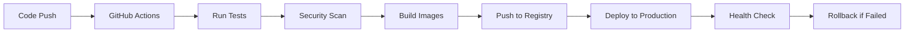

# Docker Deployment Guide

## 🐳 Overview

This project is fully containerized using Docker with support for both development and production environments. The setup includes automated CI/CD pipelines using GitHub Actions.

## 📋 Prerequisites

- Docker Engine 20.10+
- Docker Compose 2.0+
- Git
- 4GB+ RAM (recommended)

## 🚀 Quick Start

### Development Environment

```bash
# Clone the repository
git clone https://github.com/Ayush-Gautam73/Real-TIme-Whiteboard-project.git
cd mern-dashboard

# Create environment file
cp .env.example .env

# Start all services
docker-compose up -d --build

# View logs
docker-compose logs -f

# Access the application
# Frontend: http://localhost:3000
# Backend:  http://localhost:5000
# MongoDB: localhost:27017
```

### Production Environment

```bash
# Setup production environment
cp .env.production.example .env.production
# Edit .env.production with your secure values

# Deploy to production
chmod +x deploy-prod.sh
./deploy-prod.sh
```

## 🏗️ Architecture

### Service Overview

| Service | Image | Ports | Purpose |
|---------|-------|-------|---------|
| **client** | nginx:alpine + React build | 3000:80 | Frontend application with Nginx |
| **server** | node:18-alpine | 5000:5000 | Backend API with Socket.IO |
| **mongodb** | mongo:7-jammy | 27017:27017 | Primary database |
| **redis** | redis:7-alpine | 6379:6379 | Session storage & caching |

### Container Communication

```
Internet → Nginx Proxy → React Client (Port 3000)
                     ↓
                 Node.js API (Port 5000)
                     ↓
               MongoDB (Port 27017)
                     ↓
                Redis (Port 6379)
```

## 🔧 Configuration Files

### Docker Compose Files

- **`docker-compose.yml`**: Development environment
- **`docker-compose.prod.yml`**: Production environment with optimizations

### Dockerfiles

- **`client/Dockerfile`**: Development React container
- **`client/Dockerfile.prod`**: Production-optimized React + Nginx
- **`server/Dockerfile`**: Development Node.js container  
- **`server/Dockerfile.prod`**: Production-optimized Node.js

### Environment Files

- **`.env.example`**: Development environment template
- **`.env.production.example`**: Production environment template

## 📊 Health Checks

All containers include comprehensive health checks:

### Server Health Check
```bash
# Manual health check
curl http://localhost:5000/api/health

# Docker health status
docker ps --format "table {{.Names}}\t{{.Status}}"
```

### Database Health Check
```bash
# MongoDB connection test
docker exec mern-dashboard-mongodb mongosh --eval "db.runCommand('ping')"

# Redis connection test
docker exec mern-dashboard-redis redis-cli ping
```

## 🔍 Monitoring & Debugging

### View Container Logs
```bash
# All services
docker-compose logs -f

# Specific service
docker-compose logs -f server
docker-compose logs -f client
docker-compose logs -f mongodb
```

### Container Resources
```bash
# Resource usage
docker stats

# Container information
docker-compose ps
docker-compose top
```

### Debug Container
```bash
# Execute commands in running container
docker-compose exec server npm run debug
docker-compose exec mongodb mongosh

# Access container shell
docker-compose exec server sh
docker-compose exec client sh
```

## 🚀 CI/CD Pipeline

### GitHub Actions Workflows

#### **`.github/workflows/ci-cd.yml`**
- **Triggers**: Push to main/master, Pull Requests
- **Jobs**: Test → Security Scan → Build → Docker Build → Deploy
- **Features**:
  - Multi-version Node.js testing (16.x, 18.x, 20.x)
  - Security vulnerability scanning
  - Docker image building and pushing to GHCR
  - Automated deployment with health checks

#### **`.github/workflows/docker-test.yml`**
- **Purpose**: Docker-specific testing
- **Features**: 
  - Docker Compose integration testing
  - Container health verification
  - Full-stack testing in containerized environment

### Deployment Process



## 🐳 Production Optimizations

### Multi-stage Builds
- **Client**: React build → Nginx static serving
- **Server**: Dependencies install → Production runtime

### Security Features
- Non-root user execution
- Minimal base images (Alpine Linux)
- Security headers in Nginx
- Secret management through environment variables

### Performance Optimizations
- Docker layer caching
- Nginx gzip compression
- Redis session storage
- MongoDB connection pooling
- Resource limits and reservations

## 📈 Scaling

### Horizontal Scaling
```yaml
# Docker Compose scaling
docker-compose up -d --scale server=3 --scale client=2

# With load balancer
version: '3.8'
services:
  nginx-lb:
    image: nginx:alpine
    ports: ["80:80"]
    volumes: ["./nginx-lb.conf:/etc/nginx/nginx.conf"]
```

### Kubernetes Deployment
```bash
# Convert to Kubernetes manifests
kompose convert -f docker-compose.prod.yml

# Deploy to Kubernetes
kubectl apply -f .
```

## 🛠️ Maintenance

### Database Backup
```bash
# Create MongoDB backup
docker-compose exec mongodb mongodump --out /data/backup

# Copy backup to host
docker cp mern-dashboard-mongodb:/data/backup ./backup
```

### Update Images
```bash
# Pull latest images
docker-compose pull

# Rebuild with no cache
docker-compose build --no-cache

# Rolling update
docker-compose up -d --force-recreate
```

### Cleanup
```bash
# Stop and remove containers
docker-compose down

# Remove volumes (⚠️ DATA LOSS)
docker-compose down -v

# Clean unused images
docker image prune -a
```

## 🚨 Troubleshooting

### Common Issues

#### Port Already in Use
```bash
# Find process using port
lsof -i :3000
kill -9 <PID>

# Or use different ports
docker-compose -f docker-compose.yml up -d
```

#### Out of Disk Space
```bash
# Clean Docker system
docker system prune -a --volumes

# Check disk usage
docker system df
```

#### Database Connection Issues
```bash
# Check MongoDB logs
docker-compose logs mongodb

# Verify network connectivity
docker-compose exec server ping mongodb
```

### Performance Issues
```bash
# Check resource usage
docker stats

# Increase memory limits in docker-compose.yml
deploy:
  resources:
    limits:
      memory: 2G
```

## 🔗 Useful Commands

### Development
```bash
# Development with hot reload
docker-compose -f docker-compose.yml up --build

# Run tests
docker-compose exec server npm test
docker-compose exec client npm test

# Install new packages
docker-compose exec server npm install package-name
```

### Production
```bash
# Deploy production
./deploy-prod.sh

# Check production logs
docker-compose -f docker-compose.prod.yml logs -f

# Scale services
docker-compose -f docker-compose.prod.yml up -d --scale server=3
```

## 📚 Additional Resources

- [Docker Documentation](https://docs.docker.com/)
- [Docker Compose Reference](https://docs.docker.com/compose/)
- [GitHub Actions Documentation](https://docs.github.com/en/actions)
- [Nginx Configuration Guide](https://nginx.org/en/docs/)
- [MongoDB Docker Hub](https://hub.docker.com/_/mongo)